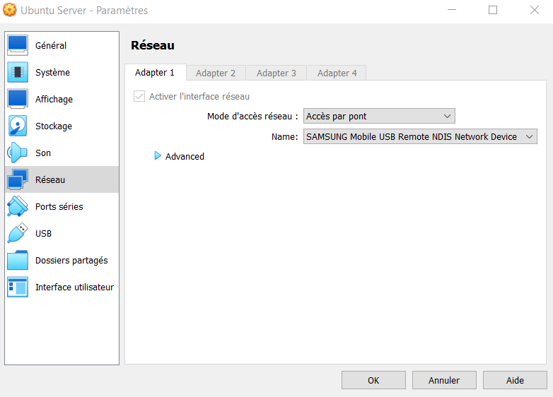

- ## Utilisation de VirtualBox
- Installation d'une image Ubuntu Server 20.04.4 dans VirtualBox
- Passage de QWERTY à AZERTY : `sudo dpkg-reconfigure keyboard-configuration`
- Création d'un user : `sudo adduser jean`
- Ajout sudo : `sudo usermod -aG sudo jean`
- Connexion bridge (avec un réseau mobile) :
- {:height 369, :width 423}
- SSH : https://www.ionos.fr/digitalguide/serveur/configuration/ubuntu-ssh/
- 
-