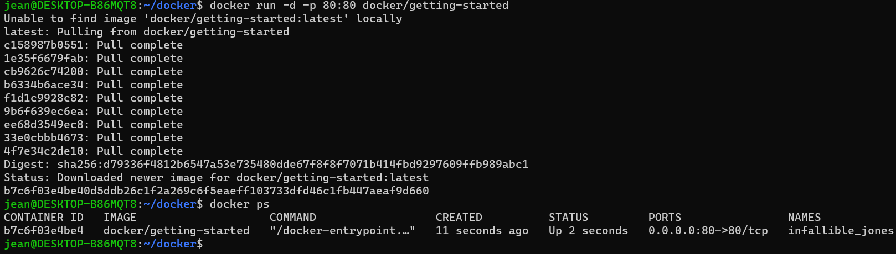
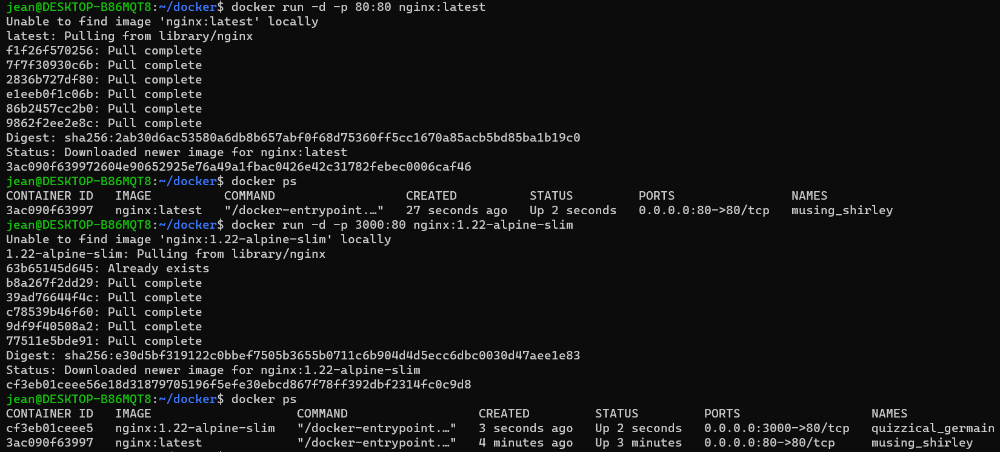
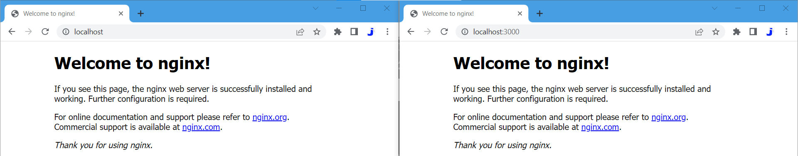

- ## Utilisation de Docker
- Installation de Docker Desktop et WSL2
- Image getting-started
  `docker run -d -p 80:80 docker/getting-started`
  
- Exécution de deux images nginx
  `docker run -d -p 80:80 nginx:latest`
  `docker run -d -p 3000:80 nginx:1.22-alpine-slim`
  
  
-
-